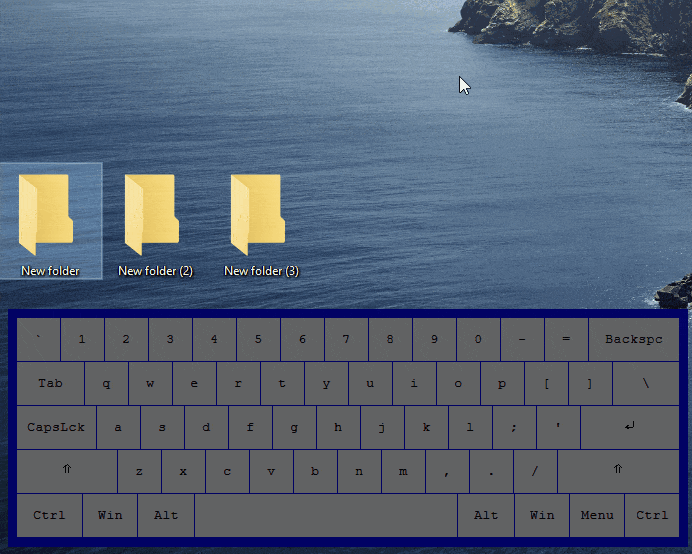
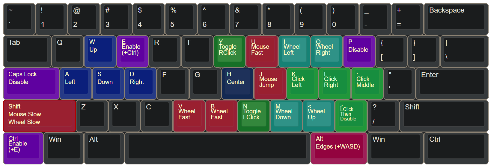
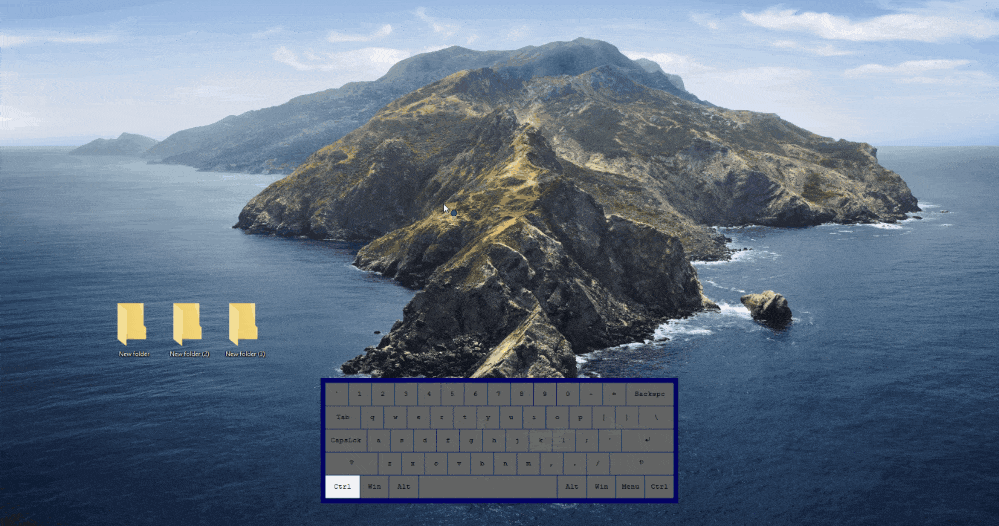

# Neo Mousekeys

  

Neo Mousekeys enables you to control your mouse cursor with a keyboard. This project started as a complete rewrite of [mouseable](https://github.com/wirekang/mouseable) and tries to replicate its feel, while fixing old bugs and adding new features.

  

  <em>Figure 1: Moving folders with your keyboard.</em>

# Installation and usage
You can either download and execute the script directly with [AutoHotkey v1](https://github.com/AutoHotkey/AutoHotkey/releases/tag/v1.1.37.01), or download and execute the pre-compiled binaries. This code was only tested with AutoHotkey v1.1.37.01, and will not run with AutoHotkey v2.

## As a script
- Download the source code.
- Open **neo-mousekeys.ahk** with [AutoHotkey v1](https://github.com/AutoHotkey/AutoHotkey/releases/tag/v1.1.37.01) (Unicode version).

## Compiled version
- Download and unzip the binaries.
- Open **neo-mousekeys.exe**.

## Usage
With the default keyboard layout, press `Ctrl+E` to activate the mouse cursor, `W`, `A`, `S`, `D` to move it and `P` or `Capslock` to disable it. Pressing Capslock will not toggle it when disabling the cursor. You can find the complete default layout below.

# Settings and keyboard layouts
You can create any keyboard layout by editing `options.ini`. By default, an optimized WASD layout is provided:

  

## Options
Some additional settings are available in `options.ini`, including system settings, custom indicator settings and other features disabled by default.

## Hotkeys
This application uses AutoHotkey's [syntax](https://www.autohotkey.com/docs/v1/Hotkeys.htm#Symbols) for defining hotkeys. In case you are not familiar with it, here are the most common scenarios:

### Using modifiers
When using modifiers, `^` is `Ctrl`, `#` is `Win`, `!` is `Alt`, `+` is `Shift`.

Example: `Enable=^e` sets the Enable key to `Ctrl+E`.

Some commands, such as Enable, support multiple keybinds. For instance, `Enable=^e RControl` would set the Enable function to both `Ctrl+E` and `Right Ctrl`.

To map a double press to the Enable command, such as double pressing `Left Ctrl` within a small timeframe, simply set `EnableDouble=LControl`.

### Using key names directly
If you want to set activation keys as a single key, use keynames found in the official [documentation](https://www.autohotkey.com/docs/v1/KeyList.htm#modifier) (common keys: LControl, LWin, LAlt, LShift, RAlt, RWin, RControl, Space).

Examples: `Enable=RControl`, `Enable=LControl & RAlt`.

# Permissions, security and running automatically at startup

Some applications running with elevated privileges (such Task Manager, Windows Settings and other system tools) will completely ignore external input from an application being run with normal privileges. Run this application as administrator if you wish to send input to such applications.

If you wish this application to run automatically at startup (with or without elevated privileges), or if you are concerned about security (false positives), see the [shared project documentation](https://github.com/vieuxtemps/ahk-shared-docs).

Note: if you use another AutoHotkey script that maps Capslock to Esc, you might need to start neo-mousekeys after such script if you wish to use Capslock as a Disable key.

# Improvements when compared to mouseable

Here are some improvements of neo-mousekeys when compared to mouseable:

- Smoother mouse movement: mouse movement will be closer to your monitor's refresh rate.

- Lower CPU usage and power draw, with customizable cycle rate.

- Very low (~2MB) memory footprint.

- Doesn't lock up keys when using modifiers: for example, if you use WASD for movement — while the application is enabled, you can now press Ctrl+W to close a browser tab, and Win+D to show the desktop.

- Jumping (teleport) won't break if you spam the jump command.

- Edge (attach) commands won't stop working if you keep the modifier pressed down.

- Improved diagonal movement: the cursor won't suddenly stop if opposite directions are pressed.

- Improved on-screen indicator: completely customizable, doesn't disappear near edges.

- Activation keybinds are more flexible and follow AHK syntax.

- Allows multiple keybinds for the same functions.

- Simplified codebase: easier to understand, modify and build.

- Portable by default: the keymap is read from a local options.ini file.

- Better defaults: ergonomic/intuitive default keyboard layout.

- For AHK users: improved/predictable interactions with other AHK scripts.

- Support for dedicated fullscreen: provides normal pointer functionality when in fullscreen, and doesn't minimize fullscreen applications when activated.

- No application crashes when it is set to run too early during the OS autostart/startup sequence.

- New feature: toggle click (hold/drag) commands for all mouse buttons.
- New feature: move cursor to the middle of the screen.
- New feature: edge commands have an offset.
- New feature: slow, fast and jump modes (cursor).
- New feature: slow and fast modes for wheel scrolling.
- New feature: click-then-disable.
- New feature: custom indicators.
- New feature: toggle slow mode (cursor & wheels).

  

  <em>Figure 2: Some of neo-mousekeys new features (edge chaining, centering, holding).</em>

# Keyboard hardware limitations
Be aware that you keyboard might not support certain key combinations to be pressed, such as when pressing 3 or more keys at the same time (see [key rollover](https://en.wikipedia.org/wiki/Key_rollover) on Wikipedia). This might be encountered when manually dragging by holding left click, movement and slow/fast mode keys. The only solutions in such case are — 1: Using toggle click instead of manually holding clicks. 2: Trying a new keymap. You can use applications such as [NohBoard](https://github.com/ThoNohT/NohBoard) to see which key combinations your keyboard hardware allows.

# Troubleshooting
In case you encounter any issues after editing `options.ini`, make sure your text editor is saving it with UTF-16 LE encoding.

# Similar and recommended tools
- [mouseable](https://github.com/wirekang/mouseable): mousekeys for Windows, the original version.
- [warpd](https://github.com/rvaiya/warpd): mousekeys for Linux and macOS.
- [windows-vim-mode](https://github.com/vieuxtemps/windows-vim-mode): stable system-wide vim keybinds and commands for Windows. 
